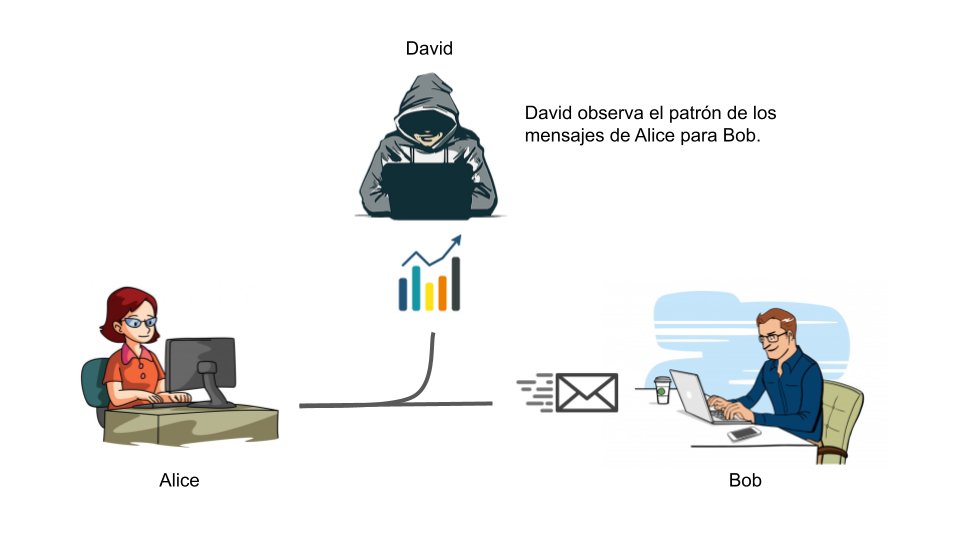

# Seguridad y Administración de Redes - Verano

 

##  1.1. La arquitectura de seguridad OSI  
 
La importancia del modelo OSI en este enfoque se debe a la naturaleza de las amenazas y ataques, así como el proceso que siguen los datos al momento de ser enviados/recibidos. Es de crucial importancia tener en cuenta cada capa de este modelo y las amenazas que se presentan en cada escenario.
 
 

##   1.2. Ataques a la seguridad
 
Los ataques a la seguridad tienen cómo característica principal ser un intento de vulnerar al proceso "normal" de una red. Hay tanto ataques pasivos, que a grandes rasgos son dificiles de detectar y los datos en cuestión prácticamente nunca son alterados. Si no que se realiza el atentado y no hay mucha (si no es que ninguna) evidencia de lo ocurrido
 
 
Tambien están los ataques activos, que normalmente suceden despues de los ataques pasivos. Los ataques pasivos son resultado de una "exploración" llevada a cabo con los resultados de múltiples ataques pasivos. Se puede intentar tomar ventaja de un proceso o función en especifico y comprometer la integridad del sistema.  

 
  

## Ataques pasivos   

 

### a) Obtención de los mensajes
 

{width=50%}

### b) Análisis del tráfico
 

{width=50%}   

  

## Ataques activos

  

### a) Suplantación de identidad
 

{width=50%}

 

### b) Modificación de los mensajes
 

{width=50%}

 

### c) Repetición de los mensajes
 

{width=50%}

### d) Interrupción al servicio
 

{width=50%}

##  1.3. Servicios de seguridad
 
En base a la vulnerabilidad de los datos a compartir, las consecuencias en caso de que la información se comprometa y el costo de aplicación de un mecanismo de seguridad se implementan (dentro del mecanismo) una serie de servicios de seguridad que tienen como tarea principal brindarle una protección especial a los recursos del sistema. 
 
 
Algunos ejemplos serían:
 
<ol>
<li>Autentificación: La seguridad de que la entidad en cuestión es quién dice ser.</li>
<li>Control de Acceso: Una serie de reglas aplicadas a diferentes instancias del sistema, para evitar el uso o explotación de una característica que podría resultar en un acceso no deseado.</li>
<li>Confidencialidad de los Datos: La protección de los datos contra una revelación no autorizada.</li>
<li>Integridad de los datos: La seguridad de que la información que se envía/recibe no ha sufrido alguna modificación en ningún punto de su ruta. </li>
<li>No repudio: Proporciona protección contra la interrupción en la totalidad de la ruta llevada a cabo. En otras palabras, evita que ninguna entidad en cuestión puedan negar la transmisión.</li>
</ol>
 
 

###   1.4. Mecanismos de Seguridad

1.- Mecanismos especificos de seguridad

 
Este tipo de funcionalidades pueden ser implementadas en la capa del modelo OSI más adecuadas.
 
 
<li>Crifrado: El uso de algoritmos para convertir la información  a inteligible y legible, gracias al resultado del algoritmo.
<li>Firma digital: Datos adjutos a una unidad de datos para simular la función de una llave.
<li>Control de acceso: Mecanismos que refuerzan los derechos de un usuario.
<li>Integridad de los datos: Mecanismos empleados para confirmar la falta de modificaciones no autorizadas al archivo base.
<li>Intercambio de autentificación: Mecanismo diseñado para comprobar la identidad de una entidad gracias al intercambio de información.
<li>Relleno de tráfico: Se refiere a la inserción de bits en un flujo de datos para frustrar los intentos de análisis de tráfico.
<li>Control de enrutamiento: Permite personalizar la ruta en la que se envían los datos, para protección preventiva o correctiva.
<li>Notarización: El uso de una tercera parte confiable que funge como asegurador de determinadas propiedades de un intercambio de datos.
 
 
2.- Mecanismos generales de seguridad

 
Este tipo de funcionalidades no son especificas de alguna capa del modelo OSI o sistema de seguridad en particular:
 
 
<li>Funcionalidad fiable: La que se considera correcta con respecto a algunos criterios
<li>
